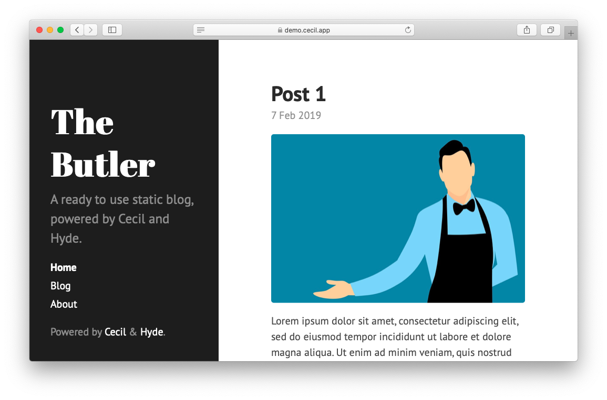

# Hyde theme

_Hyde_ is a minimalist theme for Cecil, inspired by the simplicity and elegance of the original [Hyde theme for Jekyll](https://github.com/poole/hyde).



## Installation

```bash
composer require cecil/theme-hyde
```

> Or [download the latest archive](https://github.com/Cecilapp/theme-hyde/releases/latest/) and uncompress its content in `themes/hyde`.

## Usage

Add `hyde` in the `theme` section of your `config.yml`:

```yaml
theme:
  - hyde
```

Configuration:

```yaml
hyde:
  sidebar:
    sticky: true  # Content to the bottom of the sidebar
  theme: ''       # red, orange, yellow, green, cyan, blue, magenta, brown or cecil
  reverse: false  # Reverse layout
```

### Internationalization

This theme support [localization](https://cecil.app/documentation/templates/#localization), and provides french translation (see `translations/messages.fr.yml`).

Configuration:

```yaml
languages:
  - code: fr
    locale: fr_FR
```

## License

 _Hyde_ is a free software distributed under the terms of the MIT license.

© [Arnaud Ligny](https://arnaudligny.fr)
